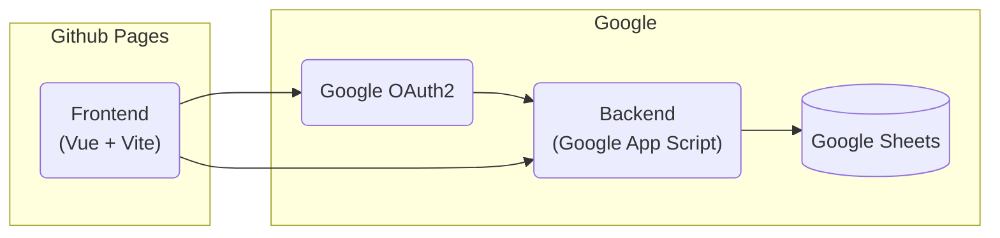

# Abordagem de Desenvolvimento

- Continuação e aprimoramento de projetos anteriores desenvolvidos por Beltrame (2023) e Izidoro (2024).
- Refatoração completa da interface utilizando **Vue.js**, com integração ao backend via **Google Apps Script**.
- Utilização de práticas ágeis, com sprints quinzenais e validação contínua com professores. 

---

# Etapas do Projeto

1. Estudo dos trabalhos anteriores e definição dos requisitos.
2. Adaptação da plataforma para suportar exercícios em linguagem  <logos-c/>.
3. Implementação da nova interface com <logos-vue />.
4. Planejamento e aplicação de testes com alunos do CTISM.
5. Coleta e análise de dados (quantitativos e qualitativos).

---
layout: two-cols
---
# Tecnologias e Ferramentas

## Frontend

- **Vue.js** para construção modular da interface.
- **Vite** para build e publicação via **GitHub Pages**.
- Integração com biblioteca **js-parsons**.

## Backend

- **Google Apps Script** para API e persistência de dados no **Google Sheets**.
- Autenticação via conta Google (OAuth2).

## Execução de Código C

- Integração com **OneCompiler** via iframe.  
- Escolha baseada em custo zero, simplicidade e ausência de login obrigatório.

::right::

---

# Estrutura da Plataforma

- O usuário acessa a interface desenvolvida em Vue.js, hospedada via GitHub Pages.

- A plataforma envia dados das respostas para o backend com Google Apps Script.

- Os dados são armazenados automaticamente em Google Sheets.

---

# Estratégia de Avaliação

- Sessão de testes realizada com alunos do curso técnico em Informática (CTISM).
- Aplicação da plataforma em laboratório, com instrução e formulário de avaliação.
- Coleta de feedback:
  - **Quantitativo:** perguntas objetivas sobre uso e usabilidade.
  - **Qualitativo:** respostas abertas e observações em tempo real.

## Roteiro de avaliação:
- **Introdução** - Apresentação do projeto (5 min).
- **Teste** - Usuários utilizam a plataforma (20 min).
- **Feedback** - Coleta de opiniões e sugestões (5 min
